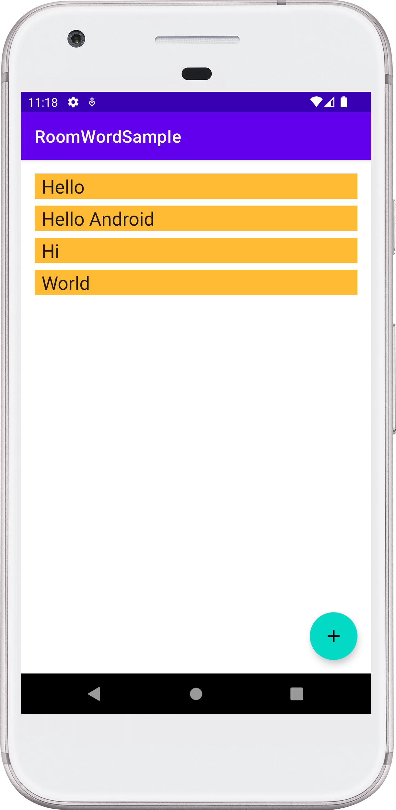
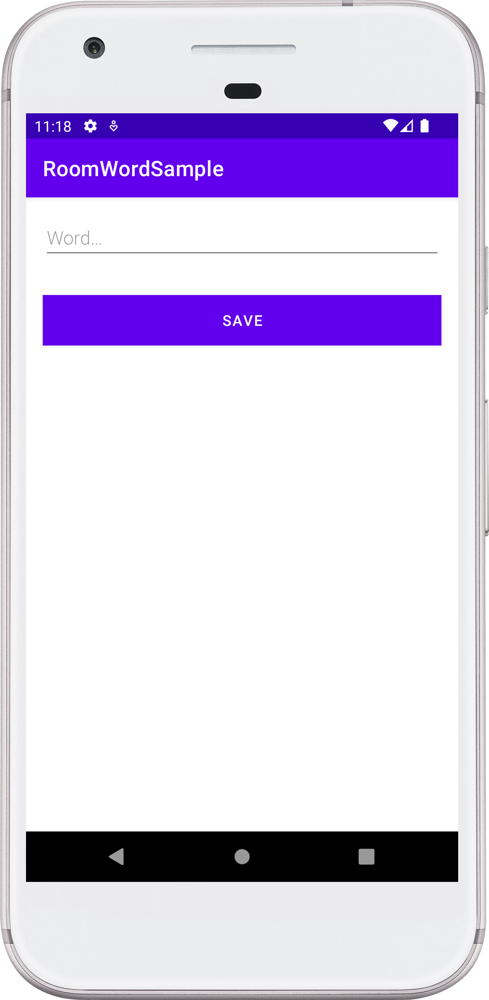

# RoomWordSample (Android App)

Android Room with a View - Java

**Support Me**

- Support me on Gumroad [here](https://alaminkarno.gumroad.com)
- Support me via buy me a coffee. [here](https://www.buymeacoffee.com/alaminkarno)

**⚠️ Instruction**

- For complete this project you can check full documentation of Google. [Click Here](https://developer.android.com/codelabs/android-room-with-a-view#0)

**Prerequisites:**

- RecyclerView and adapters
- SQLite database and the SQLite query language
- Threading and ExecutorService

**Credit**

- Code using Java with ❤️ by [Md. Al-Amin](https://github.com/alamin-karno)

## GIF:

|                            Home Screen                             |                            Add Word Screen                             |
|:------------------------------------------------------------------:|    :------------------------------------------------------------------:|  
|  |  | 

### Repository Owner Info

### Md. Al-Amin
##### Junior Software Engineer (Android & iOS) at Rokomari.com

__Email :__ [ alamin.karno@outlook.com ](mailto:alamin.karno@outlook.com) \
__Github :__ [Md. Al-Amin](https://github.com/alamin-karno) \
__Facebook :__ [মোঃ আল-আমিন খন্দকার কর্ণ](https://facebook.com/alamin.kanro) \
__Linkedin :__ [Md. Al-Amin](https://www.linkedin.com/in/alaminkarno/)
